# h2corn

`h2corn` is a high-performance ASGI server for FastAPI, Starlette, and similar applications running behind a reverse proxy, with HTTP/2 cleartext (`h2c`) used on the connection from the proxy to the application server.

## Why h2corn

- Better security for the internal proxy-to-application connection
- Higher throughput and lower latency
- Lower resource use from a Rust implementation
- Compatible with FastAPI, Starlette, and other ASGI 3 applications
- RFC 8441 WebSockets over HTTP/2
- Multi-worker supervision with graceful shutdown, reload, live scaling, worker recycling, and health checks

The central design choice is simple: keep the connection from the reverse proxy to the application server on HTTP/2 instead of translating requests back to HTTP/1.1 before they reach the application.

Keeping the internal connection on a modern protocol (HTTP/2 or HTTP/3) avoids the downgrade that can reintroduce HTTP/1.1 framing ambiguities and connection-reuse problems. A good deal of the published request-smuggling and desynchronization work focuses on exactly those downgrade paths; PortSwigger's material on [HTTP/2 downgrading](https://portswigger.net/web-security/request-smuggling/advanced/http2-downgrading), [HTTP request smuggling](https://portswigger.net/web-security/request-smuggling), and [browser-powered desync attacks](https://portswigger.net/research/browser-powered-desync-attacks) is a useful reference.

Among popular Python ASGI servers, Hypercorn is the closest comparison because it also supports HTTP/2. Uvicorn and Gunicorn are familiar migration points, but they are built around a different deployment model and with different performance characteristics.

## Quick start

Install with `uv`:

```bash
uv add h2corn
```

Or with `pip`:

```bash
pip install h2corn
```

Minimal FastAPI application:

```python
from fastapi import FastAPI

app = FastAPI()


@app.get("/")
async def index():
    return {"message": "hello from h2corn"}
```

Local development:

```bash
h2corn example:app
```

Startup output:

```text
h2corn v1.0.0 • HTTP/2 cleartext ASGI
Listening on 127.0.0.1:8000
HTTP/1 compatibility is enabled; disable with --no-http1

Started worker [12345]
127.0.0.1:54321 "GET / HTTP/1.1" 200 0.4ms tx=25b
```

Typical production-style run behind a proxy:

```bash
h2corn example:app \
  --bind 127.0.0.1:8000 \
  --proxy-headers \
  --forwarded-allow-ips 127.0.0.1,::1,unix \
  --no-http1
```

`--no-http1` is recommended as a fail-closed hardening flag. If the proxy is already configured to speak only `h2c`, it does not change the intended steady-state path; it simply makes accidental HTTP/1.1 use fail immediately.

Why keep HTTP/1.1 at all?

Because browsers generally do not speak cleartext `h2c`. Without a reverse proxy and TLS in front, a browser cannot talk directly to an `h2c`-only server. HTTP/1.1 is therefore kept for development and local testing. In production, the intended protocol remains `h2c`.

## Running behind a proxy

The intended deployment shape is:

`browser/client -> trusted reverse proxy -> h2corn application`

The proxy handles TLS termination, browser-facing protocol negotiation, and public-edge hardening. `h2corn` then handles the application side of the connection.

### Proxy headers and PROXY protocol

`h2corn` supports the two common ways a proxy can pass metadata downstream:

- `--proxy-headers` for `Forwarded` and `X-Forwarded-*`
- `--proxy-protocol v1|v2` for HAProxy PROXY protocol

They serve different purposes.

- Proxy headers carry request metadata such as scheme, host, and forwarded client address
- PROXY protocol carries transport-level peer information on the connection itself

Both are accepted only from configured trusted peers. In many deployments, proxy headers are sufficient on their own. Add PROXY protocol when the upstream is explicitly configured to send it and you want that connection-level metadata as well.

Reference: [PROXY protocol specification](https://www.haproxy.org/download/1.8/doc/proxy-protocol.txt)

### Caddy example

```caddyfile
example.com {
    reverse_proxy h2c://127.0.0.1:8000
}
```

Pair it with:

```bash
h2corn example:app \
  --bind 127.0.0.1:8000 \
  --proxy-headers \
  --forwarded-allow-ips 127.0.0.1,::1,unix \
  --no-http1
```

Reference: [Caddy `reverse_proxy` docs](https://caddyserver.com/docs/caddyfile/directives/reverse_proxy)

### HAProxy example

```haproxy
global
    log stdout format raw daemon

defaults
    mode http
    timeout connect 5s
    timeout client 30s
    timeout server 30s

frontend public_https
    bind :443 ssl crt /etc/haproxy/certs/example.pem alpn h2,http/1.1
    default_backend h2corn_backend

backend h2corn_backend
    server app1 127.0.0.1:8000 check proto h2 send-proxy-v2
```

Pair it with:

```bash
h2corn example:app \
  --bind 127.0.0.1:8000 \
  --proxy-protocol v2 \
  --proxy-headers \
  --forwarded-allow-ips 127.0.0.1,::1,unix \
  --no-http1
```

Reference: [HAProxy HTTP guide](https://www.haproxy.com/documentation/haproxy-configuration-tutorials/protocol-support/http/)

## Operations

`h2corn` has two runtime modes:

- CLI supervisor mode for multi-worker deployments
- `Server(app, config).serve()` for in-process, single-worker embedding

The CLI supervisor supports the operational features you would expect in production:

| Signal | Effect |
| --- | --- |
| `SIGINT` / `SIGTERM` | Graceful shutdown |
| `SIGHUP` | Rolling worker reload |
| `SIGTTIN` | Scale workers up |
| `SIGTTOU` | Scale workers down |

Operational notes:

- Worker supervision is Unix-only
- Workers that keep crashing are restarted with backoff
- Repeated crash loops stop the supervisor instead of respawning forever
- `timeout_graceful_shutdown` controls how long workers get to finish in-flight work
- `max_requests` and `max_requests_jitter` enable rolling worker recycling without synchronized restarts

## Configuration

Configuration precedence is:

`CLI > environment variables > TOML config > built-in defaults`

<details>
<summary>CLI and environment reference (`h2corn --help`)</summary>

```text
usage: h2corn [-h] [-c CONFIG] [--check-config] [--print-config] [--reload]
              [--reload-dir DIR] [--reload-include PATTERN]
              [--reload-exclude PATTERN] [--factory] [--app-dir APP_DIR]
              [--env-file ENV_FILE] [--host HOST] [-p PORT]
              [--bind ADDRESS]
              [--uds-permissions UDS_PERMISSIONS] [--backlog BACKLOG]
              [-w WORKERS] [--max-requests MAX_REQUESTS]
              [--max-requests-jitter MAX_REQUESTS_JITTER]
              [--timeout-worker-healthcheck TIMEOUT_WORKER_HEALTHCHECK]
              [--http1 | --no-http1] [--access-log | --no-access-log]
              [-r ROOT_PATH] [--max-concurrent-streams MAX_CONCURRENT_STREAMS]
              [--limit-request-head-size LIMIT_REQUEST_HEAD_SIZE]
              [--limit-request-line LIMIT_REQUEST_LINE]
              [--limit-request-fields LIMIT_REQUEST_FIELDS]
              [--limit-request-field-size LIMIT_REQUEST_FIELD_SIZE]
              [--h2-max-header-list-size H2_MAX_HEADER_LIST_SIZE]
              [--h2-max-header-block-size H2_MAX_HEADER_BLOCK_SIZE]
              [--h2-max-inbound-frame-size H2_MAX_INBOUND_FRAME_SIZE]
              [--max-request-body-size MAX_REQUEST_BODY_SIZE]
              [--timeout-handshake TIMEOUT_HANDSHAKE]
              [--timeout-graceful-shutdown TIMEOUT_GRACEFUL_SHUTDOWN]
              [--timeout-keep-alive TIMEOUT_KEEP_ALIVE]
              [--timeout-request-header TIMEOUT_REQUEST_HEADER]
              [--timeout-request-body-idle TIMEOUT_REQUEST_BODY_IDLE]
              [--limit-concurrency LIMIT_CONCURRENCY]
              [--limit-connections LIMIT_CONNECTIONS]
              [--runtime-threads RUNTIME_THREADS]
              [--timeout-lifespan-startup TIMEOUT_LIFESPAN_STARTUP]
              [--timeout-lifespan-shutdown TIMEOUT_LIFESPAN_SHUTDOWN]
              [--websocket-max-message-size WEBSOCKET_MAX_MESSAGE_SIZE]
              [--websocket-per-message-deflate | --no-websocket-per-message-deflate]
              [--websocket-ping-interval WEBSOCKET_PING_INTERVAL]
              [--websocket-ping-timeout WEBSOCKET_PING_TIMEOUT]
              [--proxy-headers | --no-proxy-headers]
              [--forwarded-allow-ips FORWARDED_ALLOW_IPS]
              [--proxy-protocol {off,v1,v2}]
              [--server-header | --no-server-header]
              [--date-header | --no-date-header] [--header HEADER]
              [target]

High-performance HTTP/2 cleartext ASGI server (v1.0.0)

positional arguments:
  target                The ASGI application to run, e.g., module:app.
                        (default: None)

options:
  -h, --help            show this help message and exit
  -c, --config CONFIG   Path to a TOML configuration file. [env:
                        H2CORN_CONFIG] (default: None)
  --check-config        Validate configuration, then exit without importing
                        the target or starting the server. (default: False)
  --print-config        Print the fully resolved configuration, then exit
                        without importing the target or starting the server.
                        (default: False)
  --reload              Restart the server when watched Python files change.
                        Development only. Requires workers=1. (default:
                        False)
  --reload-dir DIR      Directory to watch for reload. Repeat the flag to add
                        more directories. Overrides the default watch root.
                        (default: ())
  --reload-include PATTERN
                        Glob pattern for files that should trigger reload.
                        Repeat the flag to add more patterns. (default:
                        ('*.py',))
  --reload-exclude PATTERN
                        Glob pattern for files or directories that should be
                        ignored by reload. Repeat the flag to add more
                        patterns. (default: ('.*', '.py[cod]', '.sw.*',
                        '~*'))
  --factory             Treat the target as a zero-argument callable that
                        returns an ASGI application. (default: False)
  --app-dir APP_DIR     Import the target module from this directory instead
                        of the current working directory. (default: None)
  --env-file ENV_FILE   Load application environment variables from this file
                        before importing the target. (default: None)
  --host HOST           TCP host convenience override for a single listener.
                        When --port is omitted, the base configuration port
                        is reused.
  -p, --port PORT       TCP port convenience override for a single listener.
                        When --host is omitted, the base configuration host
                        is reused.
  --bind ADDRESS        Listener addresses to bind. Repeat the flag to add
                        more listeners. Supports HOST:PORT, [IPv6]:PORT,
                        unix:PATH, and fd://N. [env: H2CORN_BIND] (default:
                        ('127.0.0.1:8000',))
  --uds-permissions UDS_PERMISSIONS
                        Octal mask for Unix Domain Socket permissions. [env:
                        H2CORN_UDS_PERMISSIONS] (default: None)
  --backlog BACKLOG     The maximum number of queued connections allowed on
                        the socket. [env: H2CORN_BACKLOG] (default: 1024)
  -w, --workers WORKERS
                        The number of child worker processes to spawn. [env:
                        H2CORN_WORKERS] (default: 1)
  --max-requests MAX_REQUESTS
                        Maximum number of requests or WebSocket sessions a
                        worker should complete before retiring. Use 0 to
                        disable. [env: H2CORN_MAX_REQUESTS] (default: 0)
  --max-requests-jitter MAX_REQUESTS_JITTER
                        Maximum jitter added to max_requests to stagger worker
                        retirements. Use 0 to disable. [env:
                        H2CORN_MAX_REQUESTS_JITTER] (default: 0)
  --timeout-worker-healthcheck TIMEOUT_WORKER_HEALTHCHECK
                        Maximum time between worker healthcheck heartbeats
                        before the supervisor replaces the worker. Use 0 to
                        disable. [env: H2CORN_TIMEOUT_WORKER_HEALTHCHECK]
                        (default: 30.0)
  --http1, --no-http1   Whether HTTP/1.1 is supported. Intended for
                        development purposes only; disable in production.
                        [env: H2CORN_HTTP1] (default: True)
  --access-log, --no-access-log
                        Whether requests should be logged to stderr. [env:
                        H2CORN_ACCESS_LOG] (default: True)
  -r, --root-path ROOT_PATH
                        ASGI root path (to mount the application at a
                        subpath). [env: H2CORN_ROOT_PATH] (default: )
  --max-concurrent-streams MAX_CONCURRENT_STREAMS
                        Maximum active HTTP/2 streams per connection. [env:
                        H2CORN_MAX_CONCURRENT_STREAMS] (default: 256)
  --limit-request-head-size LIMIT_REQUEST_HEAD_SIZE
                        Limit the total size of an HTTP/1.1 request head in
                        bytes. Use 0 for no limit. [env:
                        H2CORN_LIMIT_REQUEST_HEAD_SIZE] (default: 1048576)
  --limit-request-line LIMIT_REQUEST_LINE
                        The maximum size of the HTTP/1.1 request line in
                        bytes. Use 0 for no limit. [env:
                        H2CORN_LIMIT_REQUEST_LINE] (default: 16384)
  --limit-request-fields LIMIT_REQUEST_FIELDS
                        Limit the number of HTTP/1.1 header fields in a
                        request. Use 0 for no limit. [env:
                        H2CORN_LIMIT_REQUEST_FIELDS] (default: 100)
  --limit-request-field-size LIMIT_REQUEST_FIELD_SIZE
                        Limit the size of an individual HTTP/1.1 header field
                        in bytes. Use 0 for no limit. [env:
                        H2CORN_LIMIT_REQUEST_FIELD_SIZE] (default: 32768)
  --h2-max-header-list-size H2_MAX_HEADER_LIST_SIZE
                        Maximum decoded HTTP/2 header list size in bytes. Use
                        0 for no limit. [env: H2CORN_H2_MAX_HEADER_LIST_SIZE]
                        (default: 1048576)
  --h2-max-header-block-size H2_MAX_HEADER_BLOCK_SIZE
                        Maximum compressed HTTP/2 header block size in bytes
                        while collecting HEADERS and CONTINUATION frames. Use
                        0 for no limit. [env: H2CORN_H2_MAX_HEADER_BLOCK_SIZE]
                        (default: 1048576)
  --h2-max-inbound-frame-size H2_MAX_INBOUND_FRAME_SIZE
                        Maximum inbound HTTP/2 frame payload size to accept
                        and advertise via SETTINGS_MAX_FRAME_SIZE. [env:
                        H2CORN_H2_MAX_INBOUND_FRAME_SIZE] (default: 65536)
  --max-request-body-size MAX_REQUEST_BODY_SIZE
                        Maximum request body size in bytes. Use 0 for no
                        limit. [env: H2CORN_MAX_REQUEST_BODY_SIZE] (default:
                        1073741824)
  --timeout-handshake TIMEOUT_HANDSHAKE
                        Time limit to establish a connection/handshake
                        (seconds). [env: H2CORN_TIMEOUT_HANDSHAKE] (default:
                        5.0)
  --timeout-graceful-shutdown TIMEOUT_GRACEFUL_SHUTDOWN
                        Time allowed for workers to finish existing requests
                        on stop. [env: H2CORN_TIMEOUT_GRACEFUL_SHUTDOWN]
                        (default: 30.0)
  --timeout-keep-alive TIMEOUT_KEEP_ALIVE
                        Idle keep-alive timeout in seconds. Use 0 to disable.
                        [env: H2CORN_TIMEOUT_KEEP_ALIVE] (default: 120.0)
  --timeout-request-header TIMEOUT_REQUEST_HEADER
                        Idle timeout in seconds while reading an HTTP request
                        head or an HTTP/2 header block. Use 0 to disable.
                        [env: H2CORN_TIMEOUT_REQUEST_HEADER] (default: 10.0)
  --timeout-request-body-idle TIMEOUT_REQUEST_BODY_IDLE
                        Idle timeout in seconds while reading an HTTP request
                        body. Use 0 to disable. [env:
                        H2CORN_TIMEOUT_REQUEST_BODY_IDLE] (default: 60.0)
  --limit-concurrency LIMIT_CONCURRENCY
                        Maximum number of concurrent ASGI request/session
                        tasks per worker. Use 0 to disable. [env:
                        H2CORN_LIMIT_CONCURRENCY] (default: 0)
  --limit-connections LIMIT_CONNECTIONS
                        Maximum number of live client connections per worker.
                        Use 0 to disable. [env: H2CORN_LIMIT_CONNECTIONS]
                        (default: 0)
  --runtime-threads RUNTIME_THREADS
                        Number of Tokio runtime worker threads per worker
                        process. [env: H2CORN_RUNTIME_THREADS] (default: 2)
  --timeout-lifespan-startup TIMEOUT_LIFESPAN_STARTUP
                        Maximum time to wait for ASGI lifespan startup in
                        seconds. Use 0 to disable. [env:
                        H2CORN_TIMEOUT_LIFESPAN_STARTUP] (default: 60.0)
  --timeout-lifespan-shutdown TIMEOUT_LIFESPAN_SHUTDOWN
                        Maximum time to wait for ASGI lifespan shutdown in
                        seconds. Use 0 to disable. [env:
                        H2CORN_TIMEOUT_LIFESPAN_SHUTDOWN] (default: 30.0)
  --websocket-max-message-size WEBSOCKET_MAX_MESSAGE_SIZE
                        Maximum WebSocket message size in bytes. Defaults to
                        16 MiB. Use 'inherit' to follow
                        `max_request_body_size`, or 0 for no limit. [env:
                        H2CORN_WEBSOCKET_MAX_MESSAGE_SIZE] (default: 16777216)
  --websocket-per-message-deflate, --no-websocket-per-message-deflate
                        Whether to negotiate permessage-deflate for WebSockets
                        when the client offers it. [env:
                        H2CORN_WEBSOCKET_PER_MESSAGE_DEFLATE] (default: True)
  --websocket-ping-interval WEBSOCKET_PING_INTERVAL
                        Interval in seconds between server WebSocket ping
                        frames. Use 0 to disable. [env:
                        H2CORN_WEBSOCKET_PING_INTERVAL] (default: 60.0)
  --websocket-ping-timeout WEBSOCKET_PING_TIMEOUT
                        Time limit in seconds to wait for a pong after a
                        server WebSocket ping. Use 0 to disable. [env:
                        H2CORN_WEBSOCKET_PING_TIMEOUT] (default: 30.0)
  --proxy-headers, --no-proxy-headers
                        Trust proxy headers (e.g., Forwarded, X-Forwarded-*)
                        if the client IP is in `forwarded_allow_ips`. [env:
                        H2CORN_PROXY_HEADERS] (default: False)
  --forwarded-allow-ips FORWARDED_ALLOW_IPS
                        Allowed IPs or networks (in CIDR notation) for proxy
                        headers. Use '*' to trust all. [env:
                        H2CORN_FORWARDED_ALLOW_IPS] (default: ('127.0.0.1',
                        '::1', 'unix'))
  --proxy-protocol {off,v1,v2}
                        Expect HAProxy's PROXY protocol on inbound
                        connections. [env: H2CORN_PROXY_PROTOCOL] (default:
                        off)
  --server-header, --no-server-header
                        Whether h2corn should add a default Server header when
                        the application did not set one. [env:
                        H2CORN_SERVER_HEADER] (default: False)
  --date-header, --no-date-header
                        Whether h2corn should add a default Date header when
                        the application did not set one. [env:
                        H2CORN_DATE_HEADER] (default: True)
  --header HEADER       Additional default response headers in `name: value`
                        form. Repeat the flag to add more headers. [env:
                        H2CORN_RESPONSE_HEADERS] (default: ())
```

</details>

## Benchmarks

The repository includes a local benchmark suite comparing `h2corn`, `uvicorn`, `hypercorn`, and `gunicorn` across baseline request handling, Unix socket transport, static files, streaming request and response paths, and WebSockets.

In the included local runs, `h2corn` leads across the tested scenarios. Hypercorn is the nearest mainstream comparison for this deployment model, and the included plots show `h2corn` ahead there as well.

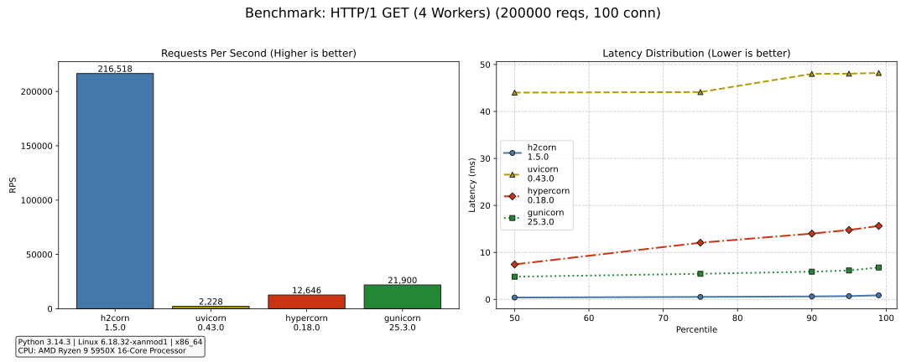

<details>
<summary>Full benchmark set</summary>

### HTTP/1 GET

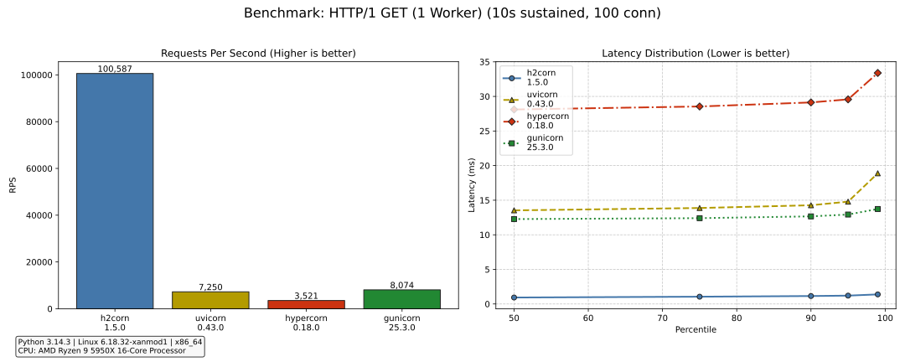


### HTTP/1 GET over Unix domain sockets (UDS)

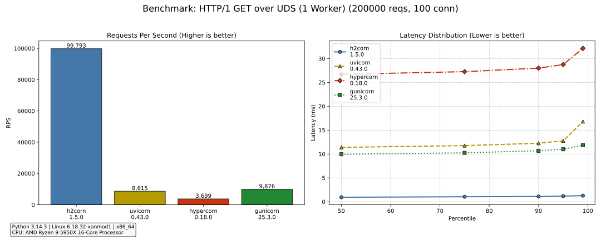

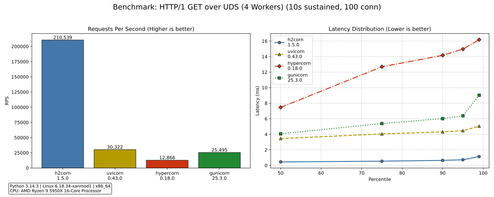

### HTTP/2 GET

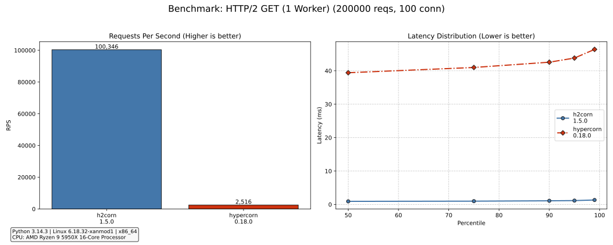

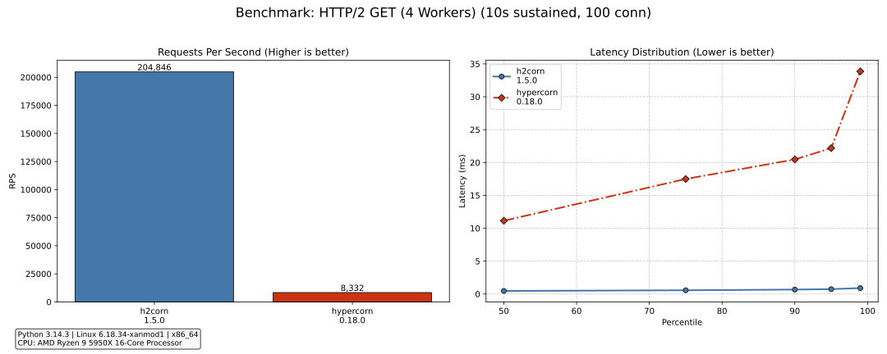

### HTTP/1 Static file

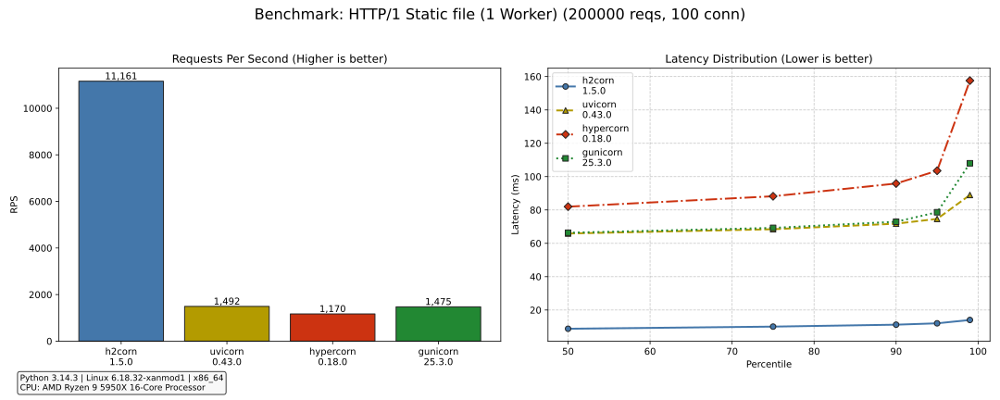

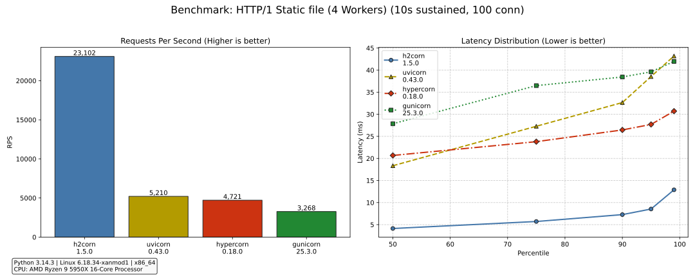

### HTTP/2 Static file

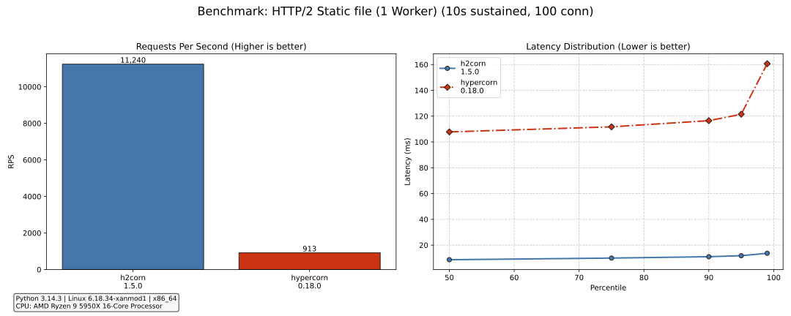

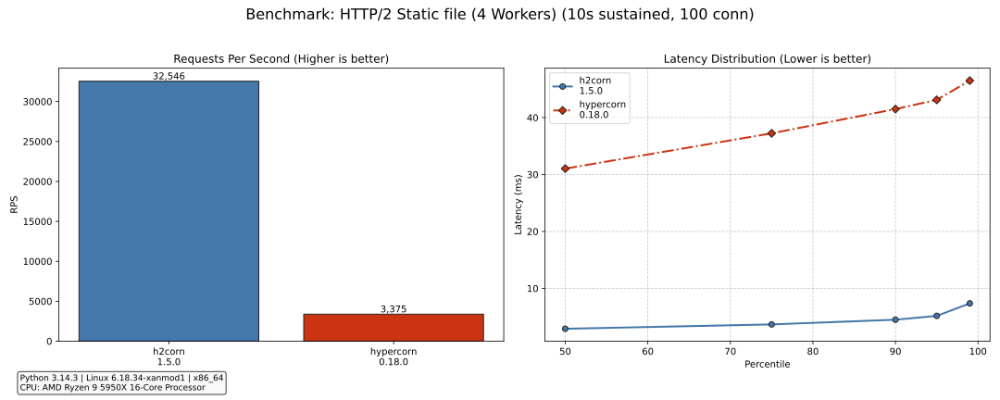

### HTTP/1 Streaming POST

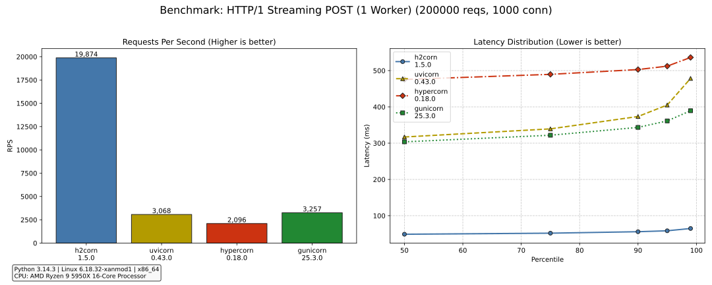

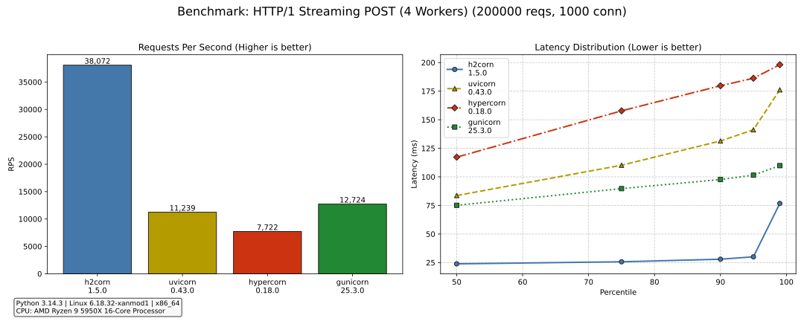

### HTTP/2 Streaming POST

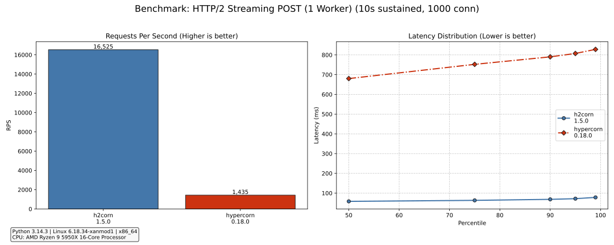

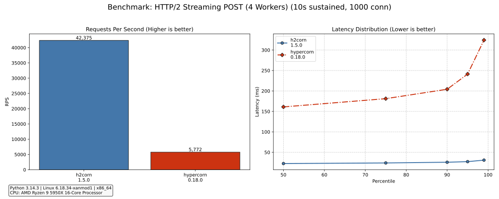

### HTTP/1 WebSocket

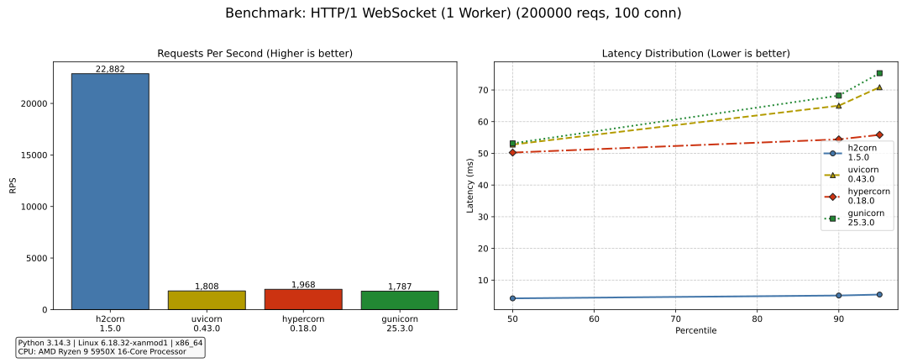

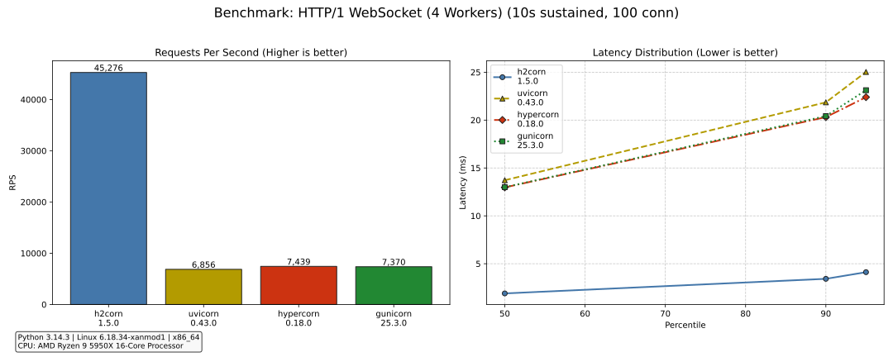

</details>

## Support

Project support is available in the GitHub issue tracker.

If you need direct help with deployment, upgrades, or performance work in Python applications, premium support is also available through [monicz.dev](https://monicz.dev).

## FAQ

### Should I expose h2corn directly to the Internet?

No. Put a trusted reverse proxy in front of it. Let the proxy handle TLS, public-edge hardening, and browser-facing protocol negotiation.

### Why prefer `h2c` behind a proxy?

Because it keeps the internal connection on a modern protocol instead of translating requests back down to HTTP/1.1 before they reach the application server. That removes a protocol-conversion boundary where HTTP/1.1 framing ambiguity and connection-reuse problems can reappear. The PortSwigger references above are a good starting point if you want the detailed background.

### Why not HTTP/3?

HTTP/3 has real advantages, but they mostly matter at the edge rather than on the connection from the reverse proxy to the application server.

It runs over QUIC and therefore brings UDP and TLS into the picture. That is often worthwhile on the public side, where network conditions, handshake behavior, and connection migration matter. On a short trusted internal connection, the gains are usually smaller. In that role, `h2c` is simpler, and more widely supported.

### Does this work on Windows?

Yes, but the full Unix-style worker supervisor does not. Windows runs in single-worker / in-process mode.
