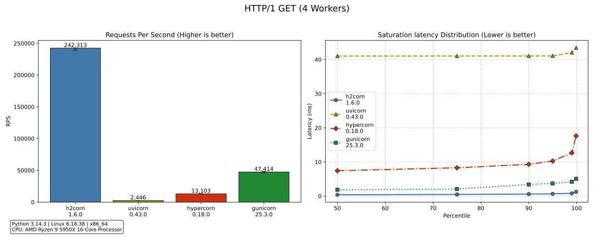

<p align="center">
  
</p>

<h1 align="center">h2corn</h1>

<p align="center">
  <strong>Blazing-fast HTTP/2 ASGI server for Python</strong>, written in Rust.<br>
  Switch the server, not your app — FastAPI, Starlette, Django, Litestar,<br>
  and any other ASGI 3 application.
</p>

<p align="center">
  <a href="https://pypi.org/p/h2corn"></a>
  <a href="https://liberapay.com/Zaczero/"></a>
  <a href="https://github.com/sponsors/Zaczero"></a>
</p>

<p align="center">
  <a href="https://h2corn.monicz.dev/">Documentation</a> ·
  <a href="https://h2corn.monicz.dev/quickstart/">Quickstart</a> ·
  <a href="https://h2corn.monicz.dev/configuration/">Configuration</a> ·
  <a href="https://h2corn.monicz.dev/benchmarks/">Benchmarks</a>
</p>

---



*Plaintext HTTP/1 GET, four workers, one Starlette application.*

- **[Lowest latency in all 20 benchmark scenarios](https://h2corn.monicz.dev/benchmarks/)** with a comparator — against `uvicorn`, `hypercorn`, and `gunicorn` on one Starlette application
- **HTTP/2 end-to-end** — the proxy speaks `h2c` straight into the application instead of downgrading to HTTP/1.1 inside your trust boundary, so the last hop stops being the weak one
- **Drop-in** — same `module:app` start line, same `--workers`, no application changes
- **[WebSockets over HTTP/2](https://h2corn.monicz.dev/websockets/)** — RFC 8441 extended `CONNECT` on the same connection, not a hijacked HTTP/1.1 socket
- **Direct TLS** — Rustls on TLS 1.2 and 1.3 only, including mutual TLS with the client identity exposed to the application
- **Built for operators** — rolling reload, live scaling, worker recycling, health checks, and bounded graceful shutdown

## Install

```bash
uv add h2corn fastapi # or: pip install h2corn fastapi
```

## A 60-second start

```python
# hello.py
from fastapi import FastAPI

app = FastAPI()


@app.get('/')
async def index():
    return {'message': 'hello from h2corn'}
```

```bash
h2corn hello:app
```

For production, put `h2corn` behind a reverse proxy that speaks `h2c` upstream,
and use `--no-http1` when every upstream client speaks HTTP/2. Deployment
recipes for nginx, HAProxy, and Caddy live in
[the docs](https://h2corn.monicz.dev/deployment/proxy/).

## Is h2corn right for you?

h2corn is a good choice when:

- you terminate TLS at a reverse proxy and want the last hop to stay on HTTP/2
- you serve WebSockets and want them multiplexed onto the same connection as
  ordinary requests
- you run long-lived deployments that need rolling reload, live scaling, worker
  recycling, and a bounded shutdown budget
- throughput and tail latency are what you are optimizing for

h2corn is not the right choice when:

- your proxy cannot speak `h2c` upstream. Caddy's documented split route sends
  WebSocket upgrades over HTTP/1.1 while ordinary requests use h2c; HAProxy is
  the candidate pure-HTTP/2 WebSocket topology
- you need gRPC, which h2corn does not serve
- you want a pure-Python server

## Benchmarks

One local run compared `h2corn`, `uvicorn`, `hypercorn`, and `gunicorn` across
baseline GETs, Unix sockets, static files, streaming, and WebSockets, on one
host and one Starlette application. No other server completed the separate
HTTP/2 multiplexed workload.

Full plots and methodology: [Benchmarks](https://h2corn.monicz.dev/benchmarks/).

## Support

Bug reports, feature requests, and questions go in the
[GitHub issue tracker](https://github.com/Zaczero/pkgs/issues).

For deployment review, migration help, performance audits, or prioritized
work, commercial support is available through
[monicz.dev](https://monicz.dev). See the
[Support page](https://h2corn.monicz.dev/support/) for details.

Security disclosures use GitHub's
[private vulnerability reporting](https://github.com/Zaczero/pkgs/security/advisories/new).
