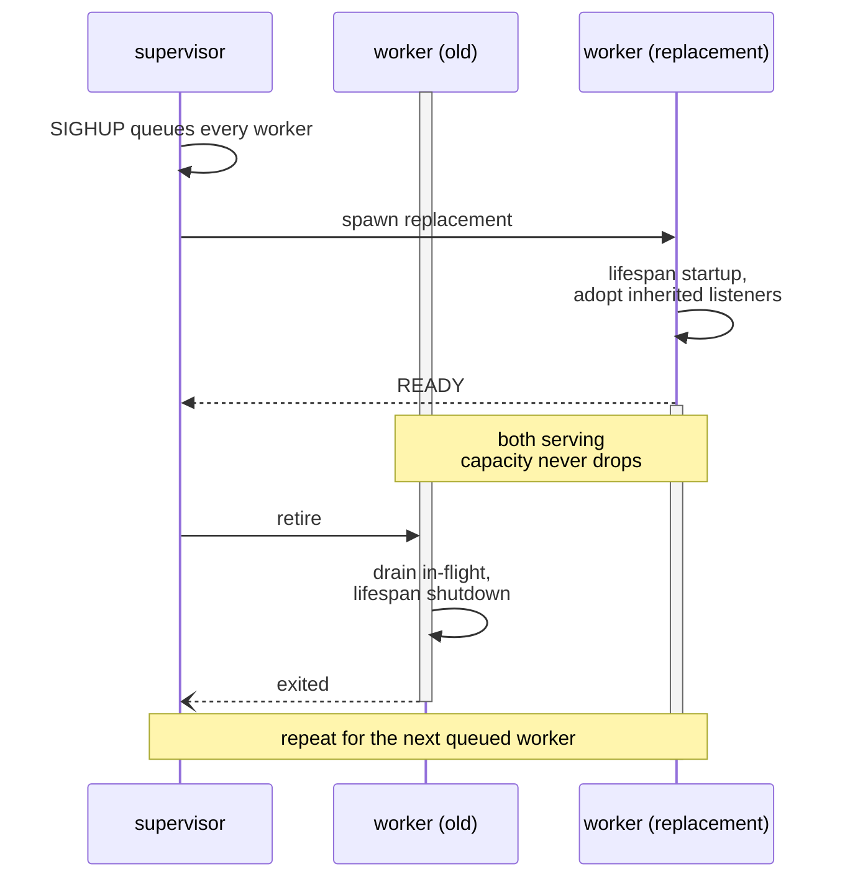

# Operations

`h2corn` runs in one of two shapes:

- The **CLI supervisor** (`h2corn module:app` or [`serve()`][h2corn.serve])
  spawns and supervises one or more worker processes. It is the production
  deployment mode.
- The **embedded server** ([`Server`][h2corn.Server]) runs a single
  worker inside your own event loop — see [Embedding](../embedding.md#inside-an-asyncio-app).

The supervisor is **POSIX-only**. On Windows, [`serve()`][h2corn.serve] automatically
falls back to single-worker, in-process mode.

`hello:app` is the import target from the [Quickstart](../quickstart.md#run-your-first-server).
Substitute the import target for your application.

<figure markdown>



  <figcaption>A bar marks a worker serving traffic. Readiness is the gate: the replacement adopts the listeners and completes lifespan startup before its predecessor is retired, so the bars overlap and a reload never leaves the fleet without a serving worker.</figcaption>
</figure>

## Worker pool

```bash
h2corn hello:app --workers 4
```

The supervisor opens listeners once in the parent process and inherits
the file descriptors into each worker. Workers accept connections
directly on a [Tokio](https://tokio.rs/) runtime — no shared
user-space accept queue.

## Shared ports across processes

```bash
h2corn hello:app --reuse-port
```

[`--reuse-port`](../configuration.md#option-reuse_port) sets `SO_REUSEPORT` on the TCP listeners so another server
process can bind the same port: start a new generation during a
zero-downtime deploy and stop the old one, or run several independently
managed processes behind one port. Workers of a single server always share
its listener, so the kernel's shared accept queue lets any idle worker pick
up a connection. TCP listeners only.

## Event loop

[`--loop`](../configuration.md#option-loop) selects the Python event-loop implementation:

```bash
h2corn hello:app --loop auto      # default
```

| Value     | Behavior                                                              |
| --------- | -------------------------------------------------------------------- |
| `auto`    | Use `uvloop` if it is installed, otherwise the stdlib asyncio loop.  |
| `asyncio` | Always the standard-library asyncio loop.                            |
| `uvloop`  | Always `uvloop`; errors at startup if it is not installed.           |

`uvloop` is an optional dependency — install it with the extra:

```bash
uv add "h2corn[uvloop]"
```

Unlike a pure-Python server, h2corn runs its accept loop, framing, and
socket I/O in Rust; the Python loop schedules the application's callbacks.
Choose between asyncio and uvloop from measurements of the real application.

## Free-threaded Python

On a free-threaded (no-GIL) CPython build, one worker can run the
application on several event loops in parallel:

```bash
h2corn hello:app --loop-threads 4
```

PyPI publishes distinct `cp3XXt` wheels for supported free-threaded CPython
releases. Importing h2corn does not silently re-enable the GIL.

Requests are balanced across the loops round-robin, and each request
runs entirely on one loop. Each loop runs a separate ASGI lifespan cycle
and receives its own lifespan state dictionary. Applications using loop-bound
resources should create them during lifespan startup; startup and shutdown
side effects therefore run once per loop and must be safe to repeat.

On a regular (GIL)
build [`loop_threads`](../configuration.md#option-loop_threads) above 1 is a no-op — the GIL would serialize the
loops anyway, so a single loop is used. Combine with [`--runtime-threads`](../configuration.md#option-runtime_threads)
to scale the I/O side accordingly. Secondary loops require the built-in
`asyncio` or `uvloop` factory; h2corn rejects multiple loop threads when
embedded in an unknown custom loop rather than silently changing topology.

[`--loop-threads`](../configuration.md#option-loop_threads) composes with [`--workers`](../configuration.md#option-workers): each forked worker runs its
own set of loop threads, so `-w 4 --loop-threads 4` is 16 event loops.
Loop threads share the process heap but require the application and its
dependencies to support concurrent execution on free-threaded Python. Workers
provide stronger isolation and independent application state. Choose the mix
from application behavior and measured throughput, latency, and memory; keep
[`workers`](../configuration.md#option-workers) times
[`loop_threads`](../configuration.md#option-loop_threads) at or below the
machine's core count unless a workload-specific measurement supports
oversubscription.

## Signals

The supervisor responds to these signals:

| Signal | Effect |
| --- | --- |
| `SIGINT` / `SIGTERM` | Graceful shutdown. Workers stop accepting new work, drain in-flight requests, run lifespan shutdown, and then exit. |
| `SIGHUP` | Rolling **application** reload. The supervisor starts one replacement worker, waits for its lifespan and listener readiness, then retires the old worker. |
| `SIGTTIN` | Scale up by one worker. |
| `SIGTTOU` | Scale down by one worker, but never below one target worker. |

Live scaling changes the pool size without restarting:

```bash
# Add two workers
kill -SIGTTIN $(cat /var/run/h2corn.pid)
kill -SIGTTIN $(cat /var/run/h2corn.pid)

# Drop one worker
kill -SIGTTOU $(cat /var/run/h2corn.pid)
```

Use [`--pid`](../configuration.md#option-pid) `/var/run/h2corn.pid` so deployment tooling can find the
supervisor reliably.

### What `SIGHUP` reloads

`SIGHUP` re-imports the CLI target in each replacement worker. The supervisor
keeps the listener file descriptors and resolved configuration while it rolls
workers.

| State or input | SIGHUP behavior | Apply a change with |
| --- | --- | --- |
| Python module and application state | Re-imported in each replacement worker | `kill -HUP <supervisor-pid>` |
| TOML configuration ([`--config`](../configuration.md#command-config)) | **Not re-read** | Validate, then restart the supervisor |
| `H2CORN_*` environment variables | **Not re-read** | Restart with the new environment |
| [`--env-file`](../configuration.md#command-env_file) application environment | **Not re-read**; the supervisor loads it once before forking | Restart with the replacement file |
| bind addresses, worker count, resource limits | **Not re-read** | Restart, or use the documented scale signals for worker count only |
| TLS certificate, key, CA bundle, and ALPN choice | **Not re-read**; the acceptor is prepared once | Replace files atomically, then restart |

`SIGHUP` does not re-read TOML, environment, listener, resource-limit, or TLS
settings. Rotate a reverse-proxy certificate at the TLS-owning proxy. For
direct TLS, atomically replace complete PEM files, run [`--check-config`](../configuration.md#command-check_config), and
restart h2corn. A failed rolling worker replacement preserves the old worker;
a full restart follows the service manager's stop/start behavior and may have
downtime.

## Worker recycling

Retire workers after a request budget to stagger memory growth and
other long-tail process state:

```bash
h2corn hello:app \
  --workers 4 \
  --max-requests 50000 \
  --max-requests-jitter 5000
```

The supervisor adds up to [`--max-requests-jitter`](../configuration.md#option-max_requests_jitter) extra requests to each
worker's budget, so retirements are spread out over time rather than
firing at the same instant on every worker.

## Health checks

Each worker emits a periodic heartbeat to the supervisor. If the
supervisor does not see a heartbeat within
[`--timeout-worker-healthcheck`](../configuration.md#option-timeout_worker_healthcheck)
seconds, the worker is replaced. This protects against a worker getting
wedged in a busy loop or a blocking syscall that never returns to the
event loop.

Set `--timeout-worker-healthcheck 0` to disable.

## Shutdown budget

Shutdown has two request phases and one lifespan phase. Native request draining
uses [`timeout_graceful_shutdown`](../configuration.md#option-timeout_graceful_shutdown); cancellation-resistant request cleanup can
use it again; lifespan shutdown starts after requests release. The supervisor's
stop budget is:

```text
2 * timeout_graceful_shutdown
+ timeout_lifespan_shutdown
+ margin for signal delivery and process reaping
```

With the defaults (`30s` and `30s`), the formula is `90s` plus signal and
reaping margin; a `100s` service-manager stop budget leaves a 10-second margin.

```mermaid
gantt
  accTitle: h2corn shutdown budget at the default timeouts
  accDescr: Request draining, cancellation-resistant cleanup, and lifespan shutdown each run for up to thirty seconds in sequence, totalling ninety seconds. Ten seconds of signal delivery and reaping margin bring the worker total to one hundred seconds, which is what the service manager stop budget must cover before it sends SIGKILL.
  dateFormat X
  axisFormat %M:%S
  todayMarker off
  section worker
    request drain — timeout_graceful_shutdown        :a1, 0, 30
    cancellation cleanup — timeout_graceful_shutdown :a2, 30, 60
    lifespan shutdown — timeout_lifespan_shutdown    :a3, 60, 90
  section supervisor
    signal delivery + reaping margin                 :a4, 90, 100
  section service manager
    TimeoutStopSec=100s, then SIGKILL                :crit, b1, 0, 100
```

<figure markdown>



  <figcaption>Phases run in sequence, each bounded by its own timeout, so the service manager's stop budget has to cover all three plus margin. Setting it below the worker total truncates whichever phase is still running.</figcaption>
</figure>

A worker that ignores cancellation can make an embedded call report a shutdown
error while the generation still owns the listener. The supervisor kills a
retiring worker at its phase deadline and logs the action. A shorter
service-manager timeout can send `SIGKILL` before request or lifespan cleanup
completes.

## Containers and Kubernetes

The container entrypoint must exec h2corn so it receives termination and owns
its worker children:

```dockerfile title="configuration template"
ENTRYPOINT ["/srv/app/.venv/bin/h2corn", "myapp.asgi:application", "--config", "/etc/myapp/h2corn.toml"]
```

If a wrapper is used, it must finish with `exec`. `READY=1` is a systemd
contract; Kubernetes does not consume it. Readiness therefore comes from an
application route or ingress using the listener's protocol. Kubernetes HTTP
probes use HTTP/1.1, so a listener started with [`--no-http1`](../configuration.md#option-http1) needs a TCP probe,
an HTTP/1.1-capable proxy endpoint, or a separate probe listener.

Liveness, readiness, and worker heartbeats have separate meanings:

| Signal | Meaning | Failure action |
| --- | --- | --- |
| Liveness | The process can answer the platform's bounded process check. It is not proof that dependencies are healthy. | Restart only after a check that cannot be served without a restart. |
| Readiness | The application is ready for new traffic, including any dependency policy owned by the app. h2corn's internal readiness waits for listeners, lifespan startup, and every worker, but does not publish a Kubernetes route. | Remove the endpoint from service routing while draining. |
| Worker heartbeat | The supervisor sees a worker heartbeat within [`timeout_worker_healthcheck`](../configuration.md#option-timeout_worker_healthcheck). | Replace the worker; repeated never-ready failures stop the supervisor. |

Kubernetes sends `SIGTERM`, removes a ready pod from endpoints asynchronously,
then waits `terminationGracePeriodSeconds` before `SIGKILL`. The period must
cover the combined shutdown formula and any `preStop` hook time. The default
30s request and lifespan settings require at least 100 seconds for h2corn's
stop budget. h2corn's signal handler stops acceptance; a fixed `sleep` in
`preStop` consumes the period before request and lifespan cleanup.

## Resource limits and slow clients

The server separately limits connection count, concurrent ASGI tasks, HTTP/2
streams, request bodies and headers, request-body idle time, handshakes,
keep-alive, response stalls, and WebSocket messages. Defaults, units, zero
semantics, and failure behavior are in the [HTTP and resource limit options](../configuration.md#http-and-resource-limits).
Slow clients consume connection and stream capacity until the relevant timeout;
[`limit_connections`](../configuration.md#option-limit_connections) and [`limit_concurrency`](../configuration.md#option-limit_concurrency) bound a worker's admission, and a
proxy request/body timeout must cover the application path it protects.

## systemd readiness

Under a `Type=notify` unit, `h2corn` sends `READY=1` when it is actually
accepting connections — with [`--workers`](../configuration.md#option-workers), once *every* worker is serving, not
when the supervisor process starts. `STOPPING=1` goes out when shutdown begins,
before draining, so the unit's published state matches what the process is
actually doing. It reports state; `systemd` runs `TimeoutStopSec` independently
of it.

```ini title="h2corn.service (configuration template)"
[Service]
Type=notify
ExecStart=/srv/app/.venv/bin/h2corn hello:app --bind 127.0.0.1:8000 --workers 4
```

The default, `Type=simple`, treats `exec` itself as readiness, so dependent
units start against a socket on which nothing is accepting yet.

When `$NOTIFY_SOCKET` is absent — every run outside a `Type=notify` unit —
h2corn sends no notification. Workers never send one either, since the
supervisor is the main PID and the only process that knows when the whole fleet
is up.

### Full systemd unit

Run the supervisor as the service user. `ExecStartPre` checks the TOML and TLS
inputs before startup, `ExecReload` forwards `systemctl reload` as the app-only
`SIGHUP`, and `TimeoutStopSec` covers the whole
[shutdown budget](#shutdown-budget).
The service user must be able to read the configured certificate and key. For a
root-only key, run h2corn as a root-owned supervisor and use its
[`--user`](../configuration.md#option-user)/[`--group`](../configuration.md#option-group) drop instead.

```ini title="myapp.service (configuration template)"
[Unit]
Description=myapp ASGI service
Wants=network-online.target
After=network-online.target

[Service]
Type=notify
NotifyAccess=main
User=myapp
Group=myapp
WorkingDirectory=/srv/myapp
EnvironmentFile=/etc/myapp/h2corn.env
ExecStartPre=/srv/myapp/.venv/bin/h2corn --check-config --config /etc/myapp/h2corn.toml
ExecStart=/srv/myapp/.venv/bin/h2corn myapp.asgi:application --config /etc/myapp/h2corn.toml
ExecReload=/bin/kill -HUP $MAINPID
Restart=on-failure
RestartSec=2s
KillSignal=SIGTERM
TimeoutStartSec=75s
TimeoutStopSec=100s
NoNewPrivileges=true
PrivateTmp=true
ProtectSystem=strict
ProtectHome=true
ReadWritePaths=/var/lib/myapp

[Install]
WantedBy=multi-user.target
```

Replace `myapp`, `/srv/myapp`, `/etc/myapp`, and
`myapp.asgi:application` with the service user, virtual environment,
configuration paths, and import target used by your deployment.
`ProtectSystem=strict` makes the filesystem read-only except for explicitly
allowed paths; add each application write path to `ReadWritePaths`.

`READY=1` and `STOPPING=1` report state; neither starts nor extends
systemd's timers.
`ExecReload` therefore reloads Python application workers only. A changed
TOML, environment file, or certificate still needs a checked replacement and
`systemctl restart myapp.service` (plus `systemctl daemon-reload` when the unit
file itself changed).

## Crash backoff

Crashed workers are restarted with exponential backoff. A sustained crash
loop stops the supervisor and reports the deployment failure.

The gate is whether anything is serving *now*, not whether the fleet ever
started: a deployment that came up cleanly and then broke stops just the same
as one that never served a request.

## TOML config files

For anything more than a handful of flags, prefer a TOML file:

```toml title="h2corn.toml"
--8<-- "h2corn.toml"
```

```bash
h2corn hello:app --config h2corn.toml
# or
H2CORN_CONFIG=h2corn.toml h2corn hello:app
```

CLI flags still win over TOML values, so a deploy can override one
setting without rewriting the file.

## Process identity

Drop privileges after binding to a low port:

```bash
sudo h2corn hello:app \
  --bind 0.0.0.0:443 \
  --certfile /etc/ssl/example/fullchain.pem \
  --keyfile /etc/ssl/example/privkey.pem \
  --user www-data \
  --group www-data
```

The supervisor binds the listeners as root, then resolves
[`--user`](../configuration.md#option-user)/[`--group`](../configuration.md#option-group) and switches identity in the workers before the
ASGI app is imported. Unix sockets created by the supervisor inherit
the same ownership, with permissions controlled by [`--uds-permissions`](../configuration.md#option-uds_permissions).

Everything that needs root is acquired before that switch. The private key may
stay `root:root` mode `0600`; the supervisor reads it once at startup and every
worker inherits the material. A key the starting user cannot read fails startup
immediately, naming the setting and the path, before any handshake.

## Observability

`h2corn` emits logs. Metrics and tracing are application integrations.

### Structured logs

[`--log-format`](../configuration.md#option-log_format) `json` encodes everything h2corn writes to stderr — the startup
banner, worker lifecycle, errors and access records — as one JSON object per
line for log shipping.

```json title="illustrative output (values vary)"
{"level":"info","event":"listening","url":"http://127.0.0.1:8000"}
{"level":"info","event":"worker_started","pid":1234}
{"level":"info","event":"request","client":"203.0.113.7:54321","method":"GET","target":"/items?q=1","protocol":"HTTP/2","status":200,"duration_ms":0.420,"rx_bytes":0,"tx_bytes":218}
```

Numbers stay numbers, so a collector does not have to strip `ms` off
`0.42ms` or `b` off `218b` to get at them. There is no timestamp field: journald,
Docker and Kubernetes stamp arrival time, and one timestamp source keeps
pipeline debugging unambiguous.

[`--access-log`](../configuration.md#option-access_log) and `--log-format` are independent — [`--no-access-log`](../configuration.md#option-access_log)
`--log-format json` keeps the diagnostics machine-readable while dropping the
per-request records.

### Metrics and tracing

Add metrics and tracing at the ASGI boundary; their observed protocol and
lifecycle behavior still depends on the server and deployment configuration.

ASGI middleware provides metrics, tracing, correlation IDs, and health routes:

| Need                       | Library                                                                                              |
| -------------------------- | ---------------------------------------------------------------------------------------------------- |
| Prometheus `/metrics`      | [`prometheus-fastapi-instrumentator`](https://github.com/trallnag/prometheus-fastapi-instrumentator) (FastAPI) or [`starlette-prometheus`](https://github.com/perdy/starlette-prometheus) (any Starlette/ASGI app) |
| OpenTelemetry traces       | [`opentelemetry-instrumentation-asgi`](https://opentelemetry-python-contrib.readthedocs.io/en/latest/instrumentation/asgi/asgi.html) |
| Request correlation IDs    | [`asgi-correlation-id`](https://github.com/snok/asgi-correlation-id), which threads an ID through your application's own logging |
| Liveness / readiness       | A plain ASGI route — e.g. FastAPI `@app.get('/healthz')` — exposed to the orchestrator              |

For FastAPI, instrument the application with Prometheus:

```python title="app.py"
from fastapi import FastAPI
from prometheus_fastapi_instrumentator import Instrumentator

app = FastAPI()
Instrumentator().instrument(app).expose(app)
```

```bash
h2corn app:app --workers 4
# Prometheus can scrape /metrics on this listener
```

## Full option reference

Every option is documented with its CLI flag, environment variable, TOML key,
and default in the
[Configuration reference](../configuration.md#option-index).
