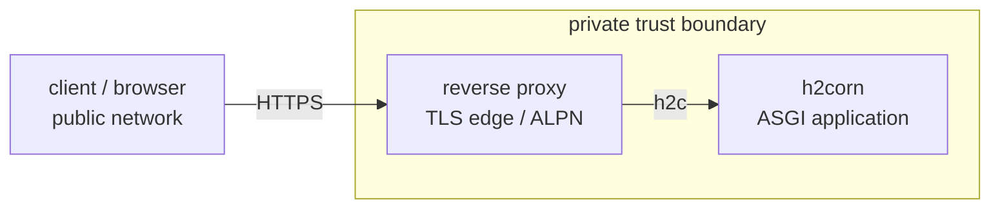

# Behind a reverse proxy

A production topology runs `h2corn` behind a reverse proxy
that handles browser-facing TLS:

```text
browser/client  →  reverse proxy (TLS edge)  →  h2corn (h2c)
```

The proxy takes care of ALPN negotiation, TLS termination, and
public-edge hardening. `h2corn` runs the application side of the
connection on `h2c` — cleartext HTTP/2 over TCP or a Unix socket inside the
trust boundary, established by
[prior knowledge](https://www.rfc-editor.org/rfc/rfc9113.html#section-3.3)
rather than an `Upgrade` handshake.

<figure markdown>



  <figcaption>The edge terminates client TLS. The private hop uses h2c, and forwarding identity is trusted only from an allowlisted proxy peer.</figcaption>
</figure>

The h2c hop avoids the HTTP/1.1 *downgrade* surface associated with
[request smuggling](https://portswigger.net/web-security/request-smuggling)
and [HTTP/2 downgrading](https://portswigger.net/web-security/request-smuggling/advanced/http2-downgrading).
A proxy with h2c upstream support keeps this boundary on HTTP/2. The edge still
requires TLS, the cleartext hop requires peer isolation, and the application
remains responsible for request validation.

A separate proxy is optional: `h2corn` can terminate TLS itself; see
[Direct TLS](tls.md#direct-tls).

## Compatibility boundaries

| Proxy | Required capability | Local syntax check |
| --- | --- | --- |
| nginx | 1.29.4+ HTTP/2 upstream support and `ngx_http_v2_module` | `nginx -V`, `nginx -t` |
| Caddy | A supported `reverse_proxy` release with documented h2c transport | `caddy validate` |
| HAProxy | A supported release with `proto h2` and PROXY protocol v2 | `haproxy -c` |

## Proxy headers and PROXY protocol

`h2corn` accepts two kinds of trust hop metadata, both opt-in and
gated by [`--forwarded-allow-ips`](../configuration.md#option-forwarded_allow_ips):

- **[`--proxy-headers`](../configuration.md#option-proxy_headers)** enables standard `Forwarded` and `X-Forwarded-*`
  processing for peers in `--forwarded-allow-ips`. By default it interprets
  `X-Forwarded-For` and `X-Forwarded-Proto`. Use
  [`--forwarded-fields`](../configuration.md#option-forwarded_fields) `for,proto,host,port,prefix` to select additional
  `X-Forwarded-*` facts, or `--forwarded-fields forwarded` to select the RFC
  7239 dialect. The two dialects cannot be combined.
- **[`--proxy-protocol`](../configuration.md#option-proxy_protocol) `v1|v2`** parses HAProxy's
  [PROXY protocol](https://github.com/haproxy/haproxy/blob/master/doc/proxy-protocol.txt)
  on inbound connections. It carries transport-level peer information
  on the connection itself for original source IP metrics or per-IP limits.

Proxy headers carry request metadata. Add PROXY protocol when the upstream is
explicitly configured to send it.

`h2corn` reads a forwarding header from the right, skipping hops that match
`--forwarded-allow-ips` and taking the first address outside that set. Client-
prepended values sit to the left of the proxy values and are ignored. A proxy
that *appends* rather than replaces — nginx's `proxy_add_x_forwarded_for`,
HAProxy's `option forwardfor`, Caddy's default — matches the parser's expected
append order.

nginx and Caddy emit `X-Forwarded-*` natively; HAProxy can send `Forwarded`
with `option forwarded`. The selected fields are applied only for a peer in
`--forwarded-allow-ips`. With `--proxy-headers` enabled, h2corn removes every
recognized forwarding header that is not selected or does not come from a
trusted peer before building `scope["headers"]`. Selected, consumed headers
remain visible to the application.

Removal covers the underscore spellings the HTTP field-name grammar permits, so
`X_Forwarded_For` cannot slip past a check written for `X-Forwarded-For`. It
also reaches an application that reads a forwarding header itself instead of
through the scope — Django under `USE_X_FORWARDED_HOST`, or a proxy middleware
in the stack. Naming the field in
[`--forwarded-fields`](../configuration.md#option-forwarded_fields) keeps it.

[`--proxy-headers`](../configuration.md#option-proxy_headers) with an empty
`--forwarded-fields`, or an empty
[`--forwarded-allow-ips`](../configuration.md#option-forwarded_allow_ips), is
rejected at startup. Each describes a trust boundary that can never act, which
is what leaving `--proxy-headers` off already spells.

With `--proxy-headers` disabled, forwarded headers are not trusted.

## nginx

`example.com`, the certificate paths, `hello:app`, and the loopback proxy peer
are placeholders. Set them to the deployment's domain, certificate files,
application import target, and proxy peer address.

[nginx](https://nginx.org/) documents HTTP/2 upstream support from **1.29.4**
onwards, where the changelog records
"*the ngx_http_proxy_module supports HTTP/2*". Set
[`proxy_http_version 2`](https://nginx.org/en/docs/http/ngx_http_proxy_module.html#proxy_http_version)
and keep the upstream URL on `http://`, which makes that hop cleartext `h2c`.
The deployed build must include `ngx_http_v2_module`.
This module has carried
[security advisories](https://nginx.org/en/security_advisories.html) since it
shipped, so run a currently supported release and check that list against it.

NGINX describes each upstream connection as handling "*one request at a time
rather than interleaving multiple requests on a single connection*". Connection
reuse and concurrency depend on the deployed build; the h2c hop provides HPACK
and unambiguous framing, while the browser-facing hop multiplexes normally.

!!! warning "WebSockets need their own HTTP/1.1 location"
    nginx performs the HTTP/1.1 `Upgrade` handshake and does not translate it
    into the [RFC 8441](https://datatracker.ietf.org/doc/html/rfc8441) extended
     `CONNECT` that HTTP/2 requires (see [WebSockets](../websockets.md#http2-only-deployment)). An
    HTTP/2 upstream cannot carry this handshake. Route `/ws` over HTTP/1.1 and
    all other requests over `h2c`. HTTP/1 must remain enabled when nginx serves
    WebSockets. For WebSockets over a pure HTTP/2 upstream, use
    [HAProxy](#haproxy).

```nginx title="nginx.conf (configuration template)"
--8<-- "nginx.conf"
```

Run h2corn with the proxy-facing settings:

```bash
h2corn hello:app \
  --bind 127.0.0.1:8000 \
  --proxy-headers \
  --forwarded-fields for,proto,host,port \
  --forwarded-allow-ips 127.0.0.1,::1
```

## Caddy

[Caddy](https://caddyserver.com/) documents native `h2c` upstream support with
its
[`reverse_proxy`](https://caddyserver.com/docs/caddyfile/directives/reverse_proxy)
directive.

!!! warning "Caddy WebSockets"
    Route WebSocket upgrades over HTTP/1.1 and ordinary requests over `h2c`.
    Caddy's h2c transport does not provide a documented RFC 8441 translation for
    this path and can return `502` for an HTTP/2 `Upgrade` request, often logged
    as `http2: invalid Upgrade request header`. HTTP/1 must remain enabled for
    this split route. A pure HTTP/2 route needs a proxy whose deployed version
    provides the RFC 8441 translation.

```caddy title="Caddyfile (configuration template)"
--8<-- "Caddyfile"
```

Run h2corn with the proxy-facing settings:

```bash
h2corn hello:app \
  --bind 127.0.0.1:8000 \
  --proxy-headers \
  --forwarded-fields for,proto,host,port \
  --forwarded-allow-ips 127.0.0.1,::1,unix
```

## HAProxy

[HAProxy](https://www.haproxy.com/) speaks HTTP/2 upstream with
`proto h2` and can layer PROXY protocol v2 on the same connection — see
the [HAProxy HTTP guide](https://www.haproxy.com/documentation/haproxy-configuration-tutorials/protocol-support/http/)
for the full directive set.

HAProxy's documented HTTP/2 support can translate a browser's HTTP/1.1
`Upgrade` handshake into the RFC 8441 extended `CONNECT` that h2corn accepts
over h2c. [`--no-http1`](../configuration.md#option-http1) is valid only when the deployed HAProxy version provides
that translation.

```text title="haproxy.cfg (configuration template)"
--8<-- "haproxy.cfg"
```

Run h2corn with the proxy-facing settings:

```bash
h2corn hello:app \
  --bind 127.0.0.1:8000 \
  --proxy-protocol v2 \
  --proxy-headers \
  --forwarded-fields for,proto,host,port \
  --forwarded-allow-ips 127.0.0.1,::1,unix \
  --no-http1
```

## Other proxies

Other proxies need the same h2c, forwarding-header, and WebSocket checks. If a
proxy cannot speak h2c, HTTP/1.1 remains the alternative private-hop protocol
and [`--no-http1`](../configuration.md#option-http1) must be omitted.
